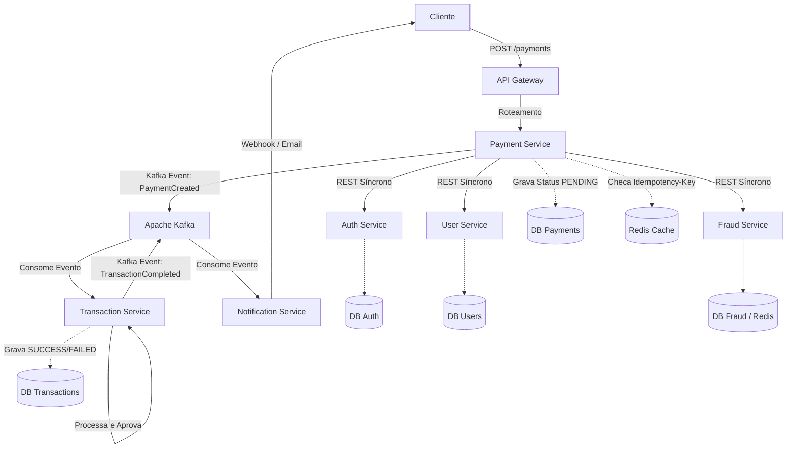

# Arquitetura Geral - PayFlow

## Visão Estratégica
O **PayFlow** é uma arquitetura orientada a microsserviços (Microservices Architecture) baseada em eventos (Event-Driven Architecture) inspirada em provedores de pagamento como o Stripe. O propósito é garantir escalabilidade independente, tolerância a falhas e responsabilidades bem delineadas entre os domínios da aplicação.

## Padrões Adotados
- **API Gateway**: Roteamento unificado e ponto único de entrada.
- **Circuit Breaker (Resilience4j)**: Prevenção de falhas em cascatas em chamadas síncronas REST.
- **Saga Pattern / Coreografia (parcial)**: Suportado pelo envio de eventos no Kafka em vez de orquestração síncrona.
- **Idempotência**: Componente essencial (provavelmente com Redis), evitando repetição de cobranças do Payment Service.
- **Dead Letter Queue (DLQ)**: Tratamento de falhas ao enviar mensagens de notificação e processamentos no Kafka.

## Fluxo de Comunicação Central
A comunicação é mista (Síncrona REST + Assíncrona Kafka):
1. **API Gateway** roteia o POST do cliente com os dados do pagamento para o **Payment Service**.
2. **Payment Service** consulta sincronamente:
   - **Auth Service / User Service** (Valida se o token e o usuário logado têm permissão).
   - **Fraud Service** (Analisa os dados da operação em tempo real para impedir transações obviamente maliciosas antes do processamento).
3. **Payment Service** envia uma mensagem assíncrona (`PaymentCreated`) via **Kafka** e responde rapidamente para o Gateway (status `PENDING`).
4. **Transaction Service** consome `PaymentCreated`, simula/realiza sua integração financeira, e dispara `TransactionCompleted` (com o status de `SUCCESS` ou `FAILED`).
5. **Notification Service** consome `TransactionCompleted` e notifica o cliente via Webhook ou Email simulado.

## Infraestrutura Integrada
- **Database**: PostgreSQL (Uma base ou schema preferencialmente isolado por microsserviço).
- **Cache**: Redis.
- **Mensageria**: Apache Kafka + Zookeeper.
- **Roteamento**: Spring Cloud Gateway.

## Diagrama de Arquitetura Geral

