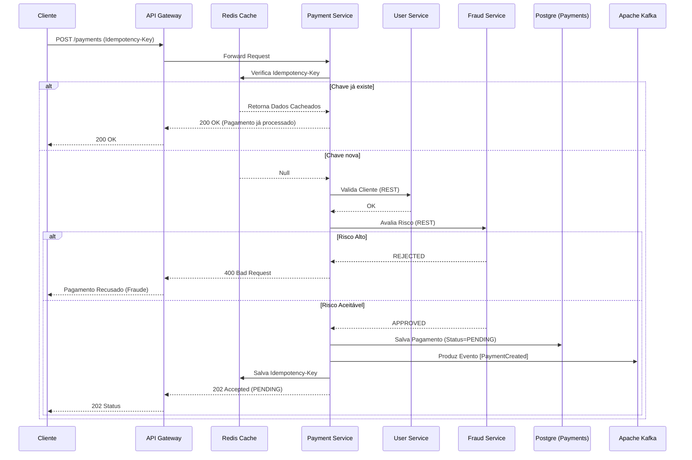

# Payment Service - Plano de Implementação

## Objetivo
É o coração coreógrafo na parte síncrona. Ele acolhe a intenção de pagar e orquestra o início dessa saga, persistindo estados temporários.

## Especificações Técnicas
- **Tecnologia**: Spring Boot + Kafka Producer + Redis.
- **Banco de Dados**: PostgreSQL (Table: `payments`).

## Responsabilidades Essenciais
1. **Idempotência (Crucial)**: Evitar cobranças duplicadas. Utilizará o cabeçalho HTTP `Idempotency-Key` enviado pelo cliente. O serviço armazena isso via Redis (Ex: `key=idempotency_uuid`, com TTL de 24h). Caso repita, devolve o mesmo `payment_id` e status sem refazer a chamada.
2. **Integração Externa (Síncrona)**: Bate no User Service para ver se cliente existe. Bate via FeignClient no `Fraud Service` para *risk rating*. Se for alta probabilidade de fraude, o status vai para `FAILED` imediatamente.
3. **Publicação no Kafka**: Salva o pagamento em banco (Status `PENDING`) e no meio da mesmíssima transação idealmente usaria Outbox Pattern ou envia o evento `PaymentCreated` (contendo dados resumidos JSON) para o tópico no Kafka.

## Endpoints
- `POST /payments`

## Plano de Execução Breve
1. Implementar verificação de idempotência no Filter ou Interceptor.
2. Criar a lógica que coordena a gravação do log em BD.
3. Implementar o Producer Kafka.

## Diagrama de Sequência - Criação de Pagamento

