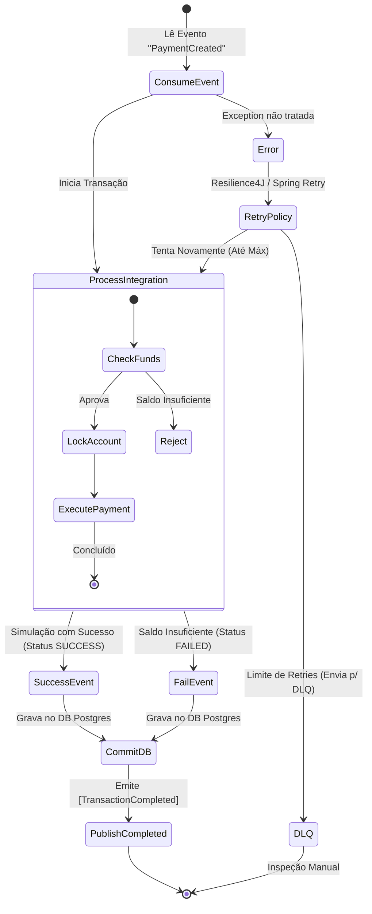

# Transaction Service - Plano de Implementação

## Objetivo
Processar a transação financeira real ("A maquininha digital"). Fica em background consumindo a fila desassociado de requisições web diretas.

## Especificações Técnicas
- **Tecnologia**: Spring Boot + Kafka Consumer.
- **Banco de Dados**: PostgreSQL (Table: `transactions`).
- **Resiliência**: Tratamento de DLQ e retentativas nativas do Spring Kafka.

## Fluxo
1. Kafka Consumer lê tópico `PaymentCreated`.
2. Serviço faz lock da conta remetente se for operação de débito ou valida com gateway dummy (simulação de Cielo/Stripe).
3. Se aprovar: Processa a liquidação financeira no registro (Salva transaction na Tabela).
4. Define Status da Transação (`SUCCESS` ou `FAILED` caso saldo excedido).
5. Como os domínios precisam saber do ocorrido, emite o evento `TransactionCompleted` para o Kafka com Payload Exemplo:
```json
{
  "paymentId": "UUID",
  "transactionId": "UUID",
  "status": "SUCCESS",
  "reason": null
}
```

## Tratamento de Falhas
Se uma exception não mapeada ocorrer e as *retries* falharem esgotando limites, envia para um Tópico de Dead Letter Queue (DLQ) do kafka com o sufixo `-dql` para inspeção manual.

## Diagrama de Fluxo - Processamento de Transação


