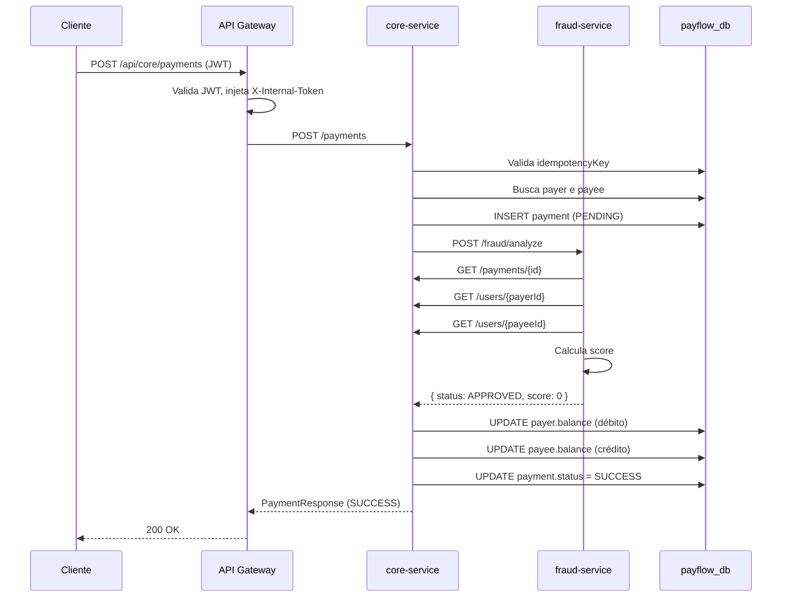

# PayFlow — Fluxos de Negócio

---

## 1. Fluxo Principal — Criar Pagamento

```
Cliente
  │
  └─► POST /api/core/payments
            │
            ▼
      [API Gateway]
        - Valida JWT
        - Injeta X-Internal-Token, X-Trace-Id
            │
            ▼
      [PaymentService.createPayment()]
        │
        ├─ 1. idempotencyKey já existe?           → 409 Conflict
        ├─ 2. Busca payer e payee                 → 404 se não existir
        ├─ 3. payer == payee?                     → 400 Bad Request
        ├─ 4. payer.balance < amount?             → 400 Bad Request
        ├─ 5. Persiste Payment(status=PENDING)    [REQUIRES_NEW tx]
        │
        └─ 6. POST /fraud/analyze
                    │
                    ▼
             [FraudAnalysisService]
               - GET /payments/{id}   (busca no core)
               - GET /users/{payerId} (busca no core)
               - GET /users/{payeeId} (busca no core)
               - Calcula score (0–100)
               - Persiste FraudAnalysisLog
               - Retorna { status, score, reason }
                    │
                    ▼
        ┌───────────────────────────────────────┐
        │     PaymentStatusHandlerFactory       │
        │  score < 30  → ApprovedHandler        │
        │  30 ≤ s < 70 → ManualAnalysisHandler  │
        │  score ≥ 70  → RejectedHandler        │
        │  PENDING_REVIEW → PendingReviewHandler│
        │  SUSPICIOUS     → SuspiciousHandler   │
        └───────────────────────────────────────┘
                    │
          ┌─────────┼──────────────┐
          ▼         ▼              ▼
      APPROVED   REJECTED    PENDING/ALERTS
   debita payer  status=FAILED  status=PENDING
   credita payee               Kafka ► payflow.payment.alerts
   status=SUCCESS
```

---

## 2. Fluxo de Revisão Manual

```
Analista
  │
  ├─ GET  /api/core/api/manual-review/pending        → lista pagamentos PENDING
  ├─ GET  /api/core/api/manual-review/payment/{id}   → detalha pagamento
  │
  └─ POST /api/core/api/manual-review/payment/{id}
           { decision: "APPROVED", reviewerId: "analista-01", ... }
                    │
                    ▼
          [ManualReviewService.processDecision()]
            │
            ├─ 1. Busca Payment pelo UUID
            ├─ 2. Persiste StatusHistory (source=MANUAL_REVIEW)
            ├─ 3. Monta FraudAnalysisResponse com a decisão
            ├─ 4. Executa PaymentStatusHandler
            │         APPROVED → ApprovedHandler (debita/credita → SUCCESS)
            │         REJECTED → RejectedHandler (→ FAILED)
            │
            └─ 5. Publica ManualReviewDecision
                   em payflow.review.completed
                            │
                            ▼
                   [AlertConsumerService]
                   notifyExternalSystem(decision)
```

---

## 3. Fluxo de Alertas Kafka

```
Handler publica PaymentAlertEvent
  em payflow.payment.alerts
            │
            ▼
  [AlertConsumerService.handlerPaymentAlert()]
            │
            ├─ alertType = "PENDING_REVIEW"   → sendEmailToAnalysisTeam()
            ├─ alertType = "MANUAL_ANALYSIS"  → notifyManualAnalysisSystem()
            └─ alertType = "SUSPICIOUS"       → notifySecurityTeam()
```

---

## 4. Cálculo de Score Antifraude

| Condição | Pontos |
|---|---|
| `amount > R$ 25.000` | +30 |
| `payer.balance < amount` | +30 |
| `payer.status == INACTIVE` | +40 |
| `payee.status == INACTIVE` | +30 |
| `payee criado há < 7 dias` **E** `amount > R$ 35.000` | +70 |
| **Teto** | **100** |

| Score | Status | Ação no core-service |
|---|---|---|
| 0 – 29 | `APPROVED` | Transferência executada → `SUCCESS` |
| 30 – 69 | `MANUAL_ANALYSIS` | Pagamento → `PENDING` + alerta Kafka |
| ≥ 70 | `REJECTED` | Pagamento → `FAILED` |

---

## 5. Diagrama de Sequência — Pagamento Aprovado


